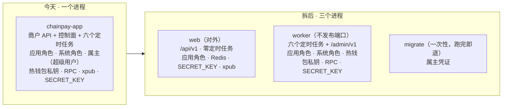

# 进程拆分 · web 与 worker（M6 之后 · 交接文档）

> 写于 2026-09-15，交给另一个会话实现。
> 用户的决定：**把入账、发送、追踪、对账拆成独立进程，只有它配 `chainpay_system` 账号，Web 进程不配。** 这是几个方案里边界最硬的一个。
> 本文**已定的只有上面这一句**；其余标「建议」的，都要先和用户逐条确认（第二节）。

**给新会话的开场白**（用户复制过去即可）：

```
读 docs/knowledge/m6-process-split.md 与 CLAUDE.md 全文。按文档「交接须知」开工：
先处理未提交的索引器改动，再按 CLAUDE.md §3 写 before 问题（只提问），再和我逐条确认第二节的取舍。
```

## 交接须知

**仓库状态（2026-09-15）**

- HEAD 是 `542b3d1`（系统池与事务管理器改为限定名 system 的 bean）。
- 工作区里有**一批未提交的改动**：索引器四个类各拆出一个写入类（`BatchWriter` / `ChainHeadWriter` / `ReorgWriter` / `ReconcileWriter`），加上测试支撑 `TransactionalProxy`、`IndexerWriters`，守卫 `IndexerWritersTransactionalTest`，CLAUDE.md 也同步改了。全套 567 条全绿，但用户还没说提交。**开工前先请用户看这批改动的变更集，由用户决定是否提交**，别让两件事混在同一批 diff 里。
- 还没定、但和本题无关的：`SystemLedger` 要不要也改成注解写法（方案 A / B）。拆分后 `SystemLedger` 整个留在 worker，两件事互不影响，**不要混进这次**。

**流程（CLAUDE.md，硬要求）**

- §3：先写 `docs/retro/M6-split-before.md`，这一步 AI **只提问**（第五节有现成的问题）。之后每一小步都走：红测 → 绿 → 拆墙 → 全套 → 真跑 → 讲。
- 讲解按「讲解的结构」来：先整体，再基础知识，再逻辑与图，最后单独讲代码。讲到具体代码时把代码附上。
- 提交前先给用户看变更集。用户说「提交」才提交，说「push」才推送。按路径 `git add`，不要用 `-A`。
- 会话工具的怪癖：GateGuard 会拦第一条 Bash；shell 是 zsh，`--include=*.java` 不加引号会报 no matches，`for f in $F` 也不会按换行拆分。

**安全规矩**

- `env/*.env`、私钥、助记词、API key 一律不进 git、yml、代码、日志和对话。
  - 拆 env 文件时**只按变量名搬行**，不 cat，不回显值。
  - 想知道容器里有哪些变量，只看名字：`env | cut -d= -f1`。
- RPC 地址里带 key，按口令对待，日志里只打主机名。用户的 xpub 永远不打印。
- 需要外部规范原文时，浅克隆到 scratchpad，不用 WebFetch 或 WebSearch。

## 〇、为什么拆，拆完换来什么

今天只有一个进程 `chainpay-app`。商户 API、控制面、六个定时任务都在里面，所有凭证也都在它的环境变量里。
商户 API 是对外的一面，最可能出事，比如注入、反序列化或逻辑漏洞。它一旦被攻破，攻击者拿到的是整个进程的钥匙串。



拆完以后，web 被攻破时手里只剩四样：应用角色（RLS 对它无条件生效）、Redis、`SECRET_KEY`、xpub。
它**拿不到**的有四样：能看全部商户数据的系统角色、热钱包私钥、RPC key、迁移用的属主凭证。

拆分**换不来**的也要说清，别让人以为拆完就万事大吉：

- 控制面放在哪个进程，那个进程就握有控制面的全部权力。建议把控制面放进 worker（取舍 3）。它的端口不发布，只在容器内回环上监听，从宿主上要 `docker exec` 才打得到。
- `SECRET_KEY` 两个进程都有：web 验签要用它，worker 发凭证时加密也要用它。

## 一、现状清单：谁今天需要什么

以下全部来自读代码；实测过的会单独标出。

| 部件 | 今天要的身份 / 凭证 | 证据 | 拆后 |
|---|---|---|---|
| 商户 API：转账、收款地址、提现（`/api/v1`） | 应用角色 + Redis + `SECRET_KEY` + xpub | `TransferController`、`DepositController`、`WithdrawalController`；Redis 只有 `ApiKeyAuthFilter` / `RedisRateLimiter` / `ReplayGuard` 在用 | web |
| 提现时的「平台自己的地址」检查 | **系统身份**（要看全部商户的收款地址），外加**热钱包私钥**（只是为了比对地址） | `WithdrawalService.java:36-37`、`:129-138` | web，改用取舍 2 的办法 |
| 索引器 | 应用角色 + RPC | `ChainIndexerConfig.java:45` | worker（取舍 4） |
| 入账 | 系统身份 + RPC；装配条件里还要求 xpub，但代码并不读它 | `DepositPostingConfig.java:18`；读 xpub 的只有 `DepositConfig.java:31` | worker |
| 发送、追踪 | 系统身份 + RPC + 热钱包私钥 | `PayoutSendConfig.java:24`、`PayoutConfig.java:17` | worker |
| 对账（判官） | 系统身份 + 两个 RPC | `AuditConfig.java:17` | worker |
| 告警 | 读本进程的 `work` 健康组 | `AlertConfig`、`application.yml:197` | worker（取舍 5） |
| 控制面：待审列表、批准、驳回、限额 | 系统身份 | `PayoutApprovalService.java:33/41/51/67` | worker（取舍 3） |
| 控制面：注资登记与列表 | 系统身份（`hot_wallet_funding` 只授权给了系统角色，V26:22） | `HotWalletFundingService` | worker |
| 控制面：对账查看、手动跑一轮 | 系统身份（查看其实应用角色也有 SELECT 权限，V24:36） | `AuditService.java:69`、`:108` | worker |
| 控制面：索引器状态 | 进程内存里的调度器对象 | `IndexerStatusController.java:66-67` | worker（和调度器同在一个进程，代码不用改） |
| 控制面：登录、商户与凭证 | 应用角色 + `SECRET_KEY` | `AdminAuthController`、`AdminController`（管理员表授权给了应用角色，V27） | worker |
| 健康部件 `hotWallet` | 系统身份 | `OpsHealthConfig.java:35` | worker |
| 启动自检（身份核对 + 判官） | 系统身份 | `SystemLedger.start` | 只在 worker |
| 启动时跑迁移 | **属主 `chainpay`，开发库里它是超级用户（实测）** | `application.yml:52-58` | 只在迁移那一步（取舍 1） |

两个平面按路径前缀已经分得很干净：

- `ApiKeyAuthFilter` 只管 `/api/`（`:114-115`）。
- `AdminAuthFilter` 只管 `/admin/`（`:72-73`），而且要求请求来自回环地址、不经过代理（`:85`）。

## 二、取舍（我的建议，用户定）

| # | 题 | 选项 | 建议 |
|---|---|---|---|
| 1 | 迁移用的属主凭证由谁持有 | A 照旧：web 和 worker 启动时都能跑迁移（即 M6 取舍 6 的兜底）；B 只有部署时「只迁移」那一步持有，两个常驻进程都不持有 | **B**。理由见表下「为什么 1 是前提」 |
| 2 | web 怎么判断「这是平台自己的地址」 | A 在库里建一个只回答是或否的函数，按函数属主的权限执行，只授权给应用角色；B 建一张不带租户、不开 RLS 的地址表，用触发器同步；C 把这项检查挪到 worker，发送前再做，商户请求时不拦 | **A，再在发送侧加第二道**。B 等于把全部商户的收款地址名单交给应用角色，而拆分要挡的正是这个。C 会把同步返回的 400 变成事后异步驳回，改了 API 约定 |
| 3 | 控制面（`/admin/v1`）放哪 | A 留在 web，管理操作写进命令表，由 worker 取出执行；B 整个搬进 worker，主端口只绑容器内回环、不发布，`tools/admin.sh` 改为 exec 进 worker；C 给 web 一个权限窄一些的第三个数据库角色 | **B**。理由见表下「为什么是 B」 |
| 4 | 索引器放哪 | A 放 worker；B 留在 web | **A**。这样 web 不再需要 RPC 地址（地址里带 key）；索引器状态接口和调度器在同一个进程，代码一行不用改 |
| 5 | 告警由谁发 | A 两个进程各发各的：web 看 Redis，worker 看索引器、热钱包、判官；B 只有 worker 发，worker 连 Redis 只为做健康检查 | **B**。这样 web 保持「零定时任务」，这是一条能测的不变量。以后 web 多开几份时，A 会让同一条告警重复发好几遍。代价是 worker 要多拿 Redis 的主机和端口，这两个不是密钥 |
| 6 | 用什么把一份代码装配成两个进程 | A Spring profile `web` / `worker`，启动时核对恰好激活了一个；B 自定义属性加 `@ConditionalOnProperty`；C 拆成两个 Maven 模块 | **A**。每个进程的健康分组、端口、Flyway 开关放在各自的 `application-web.yml` / `application-worker.yml` 里。C 的边界最硬（web 模块连 `SystemLedger` 都 import 不到），但学习项目中途大搬家不划算，所以放进「不做的」，并写明什么时候回来换 |
| 7 | compose 与发布 | 服务改名为 `web` + `worker`，还是保留 `app` 再加一个 `worker`；以及发布顺序 | **改名**，反正部署脚本、守卫测试和 `admin.sh` 都要动。两个服务用同一个镜像标签，顺序是：迁移 → 换 worker → 验证 → 换 web → 验证，任何一步失败两个一起回滚。先换 worker，是因为它出问题时商户 API 还没动 |

### 为什么 1 是前提，不是选项

拆分要做到的是：web 手里没有能看全部数据的钥匙。

- 今天 `chainpay-app` 容器的环境里有 `CHAINPAY_FLYWAY_USER` / `_PASSWORD`。这是实测，只看了变量名。
- 开发库里，这个属主 `chainpay` 是**超级用户**（实测 `rolsuper = t`）。超级用户能关 RLS、改策略、删表，权力比系统角色大得多。

所以，如果只拿走系统角色、却留着属主凭证，这次拆分就只剩个形式。

代价是拿掉了 M6 取舍 6 的兜底：新镜像碰上还没迁移的库时，不会再自己迁移。可以补一道检查：启动时读 `flyway_schema_history` 的最高版本，低于代码的期望就拒绝启动。这需要给应用角色这张表的 SELECT 权限。补不补，要和用户确认。

### 为什么控制面选 B

先认清一件事：接管理请求的那个进程，握有管理操作的全部权力。

**A 看着把权力留在了 worker，其实没挡住。** 应用角色对 `admin_session` 有 INSERT / UPDATE 权限（V27）。被攻破的 web 可以往会话表里造一条会话，再往命令表里写「批准某笔提现」。A 还要多写命令表、执行器和异步状态接口，索引器状态接口也得改成只读库。

**B 反而简单。** 六个管理控制器连同它们的依赖整体搬进 worker。worker 的主端口绑在容器内的 127.0.0.1 上，同一个 compose 网络里的 web 也够不着。只有能在宿主上执行 `docker exec` 的人才打得到，而这种人本来就能直接读 env 文件。

**C 让 web 继续握着一个强凭证**，违背了用户定下的原则。

### 取舍 2 里的「函数」是什么（给用户的基础知识）

PostgreSQL 有一种 `SECURITY DEFINER` 函数，执行时用的是**函数属主**的权限，而不是调用者的。应用角色调用它，只能拿到 true 或 false，拿不到任何一行数据。

这里藏着一个坑，见第五节坑 3。

## 三、拆成八个小步（每步：红测 → 绿 → 拆墙 → 全套 → 真跑 → 讲）

| 步 | 做什么 | 红测 / 守卫（先写） |
|---|---|---|
| ⓪ 开工前 | 请用户处理未提交的索引器改动；写 `docs/retro/M6-split-before.md`（只提问）；和用户逐条确认第二节 | — |
| ① 进程身份，凭证放错就不启动 | **profile**：`web` / `worker` 必须恰好激活一个，否则拒绝启动。**web 的禁用名单**：`chainpay.system-db.password`、`spring.flyway.password`、`chainpay.payout.hot-wallet-key`、`chainpay.chain.rpc-url`、`chainpay.chain.audit-rpc-url`、`chainpay.alert.webhook-url`，出现任何一个就拒绝启动。**worker 的禁用名单**：`spring.flyway.password`、`chainpay.deposit.xpub`。**怎么查**：在 `Environment` 上查，环境变量、系统属性、yml 都算；报错只写变量名，不带值（判断「有没有」的口径见第五节最后一段） | 每个禁用的名字各写一条：上下文起不来，报错里点出名字、不含值。两个 profile 都激活或都没激活，也起不来 |
| ② 拆掉 web 对系统身份的最后一处依赖 | **新迁移**：建取舍 2 的函数，同时查 `deposit_address` 和 `hot_wallet`。要点有四条：<br>• 声明 `SECURITY DEFINER`。<br>• 钉死 `SET search_path`。开发库的属主是超级用户，不钉就可能被人换掉查找路径。<br>• 先 `REVOKE EXECUTE ... FROM PUBLIC`（PostgreSQL 默认给 PUBLIC 执行权），再只授权给 `chainpay_app`。<br>• 函数体里先核对执行身份能不能看到全部行（超级用户或 BYPASSRLS），看不到就抛异常，照 V22 判官「拒绝盲跑」的做法（`V22__scan_patch.sql:18-31`）。<br>**`WithdrawalService`**：去掉 `SystemLedger` 和 `Optional<HotWalletSigner>`。<br>**发送侧第二道**：目标是任何平台地址就不广播。按关键字没搜到现成的检查，先读一遍 `PayoutSender` 确认 | **只有应用角色的上下文里**：提现到别家商户的收款地址 → 400 `INTERNAL_ADDRESS`；提现到热钱包地址 → 400。<br>**函数守卫**：确认是 SECURITY DEFINER、search_path 已钉死、PUBLIC 没有执行权。<br>**坑 3 的专门测试**：在测试库里建一个非超级用户、非 BYPASSRLS 的角色当属主，调用时必须抛异常，不能返回 false。<br>**发送侧**：目标是热钱包自己时不广播 |
| ③ 装配拆开 | • 按第一节「拆后」那一列，给配置类和控制器挂上 profile。<br>• 把 `@EnableScheduling` 从 `ChainIndexerConfig` 挪到一个只在 worker 生效、**不看节点配置**的类上（坑 2）。<br>• `DepositPostingConfig` 的装配条件去掉 xpub。<br>• 拆开 `OpsHealthConfig`。<br>• `work` 分组只写在 worker 的 profile yml 里。Boot 4.1 启动时默认会校验分组成员是否存在（`management.endpoint.health.validate-group-membership` 默认 true，已查元数据确认），写错就起不来，这是好事。<br>• worker 主端口默认绑回环；compose 里不要像 `app` 那样设 `0.0.0.0`。宿主上直接跑 jar 时，两个进程的端口不能撞。<br>• 测试基类拆成 web 和 worker 两个。目前有 39 个文件带 `@SpringBootTest`（含基类） | **web 上下文**：<br>• 没有 `SystemLedger`、`systemDataSource`、`systemTransactionManager`、`HotWalletSigner`、`ChainReaders` 这些 bean。<br>• 注册的定时任务数是 0（数法照 `Migrate.Outcome.scheduledTasks`）。<br>• 没有任何 `/admin/` 映射。<br>• `db` 健康项里只有主池。<br>**worker 上下文**：<br>• 没有 `/api/` 映射。<br>• 不配节点时也会调度告警任务，证明调度不再依赖节点配置。<br>• 配了节点时是 6 个任务，调度线程数不少于任务数。<br>`ControllerBoundaryTest` 的源码扫描保留 |
| ④ 迁移凭证只在迁移那一步 | • web 和 worker 的 profile yml 里设 `spring.flyway.enabled: false`。**不能改基础 yml**，因为 `Migrate` 读的就是它（`Migrate.java:15-30`）。<br>• 部署时的「只迁移」使用单独的 `env/migrate.env`。<br>• 要实测：只给属主凭证时 `--migrate-only` 能不能起来。它的最小上下文会装配主数据源，而 `spring.datasource.password` 没有默认值（`application.yml:30`） | web 和 worker 的上下文里没有 Flyway bean；只有属主凭证时 `MigrateOnlyTest` 仍然全绿 |
| ⑤ env、compose、部署脚本 | • 三份 env 文件，各配一份 `.example`，内容见第四节。<br>• compose：`web` 和 `worker` 用同一个镜像，靠 `SPRING_PROFILES_ACTIVE` 区分。加固项照抄现在的 `app`：去掉全部能力、禁止提权、根文件系统只读、tmpfs、限内存、限进程数、healthcheck 打 readiness、`restart: unless-stopped`。worker 不写 `ports:`。<br>• `deploy.sh` / `rollback.sh` 按取舍 7 改。<br>• `tools/admin.sh` 和 `--create-admin` 都改为指向 worker | • `ContainerGuardTest` 两个服务都要守。<br>• 新增一条：`web.env.example` 里不能出现第四节中 web 列标 ✗ 的任何名字。<br>• `DeployGuardTest` 的顺序断言把两个服务都加进去 |
| ⑥ 真跑与演练 | • 两个容器都 healthy，readiness 都返回 200。<br>• 商户流程用 `tools/api.py`：分配收款地址、发起提现。<br>• 管理流程用 `tools/admin.sh`：批准提现。<br>• 演练一：停掉 worker，web 的 `/api` 照常工作，提现照样受理并冻结；worker 恢复后，队列被消化掉。<br>• 演练二：停掉 Redis，worker 发出告警。<br>• 演练三：部署一次，再回滚一次 | • web 容器里按名字查（`env \| cut -d= -f1`），第四节 web 列标 ✗ 的一个都没有。<br>• worker 容器里没有属主凭证，也没有 xpub |
| ⑦ 文档 | • CLAUDE.md「数据库身份与作用域」的表格加一列「在哪个进程」，包结构和控制面那几段跟着改。<br>• `docs/runbook/ops.md` 加一节「两个进程」：看哪个进程的健康、日志在哪、怎么只重启其中一个。<br>• LEARNING-PATH 加一条记录。<br>• `m6-launch.md` 的「不做的 · 多实例」补一句：web 已经没有定时任务，可以多开了，但这次仍然不做。<br>• 本文第七节打勾 | — |

## 四、每个进程拿哪些变量（只列名字）

| 变量 | web | worker | migrate |
|---|---|---|---|
| `CHAINPAY_DB_URL` | ✓ | ✓ | ✓ |
| `CHAINPAY_DB_USER` / `_PASSWORD`（应用角色） | ✓ | ✓（索引器、管理员表要用） | 看 ④ 的实测结果 |
| `CHAINPAY_SYSTEM_DB_USER` / `_PASSWORD` | ✗ 有就拒绝启动 | ✓ | ✗ |
| `CHAINPAY_FLYWAY_USER` / `_PASSWORD` | ✗ 有就拒绝启动 | ✗ 有就拒绝启动 | ✓ |
| `CHAINPAY_PAYOUT_HOT_WALLET_KEY` | ✗ 有就拒绝启动 | ✓ | ✗ |
| `CHAINPAY_CHAIN_RPC_URL` / `_AUDIT_RPC_URL` | ✗ 有就拒绝启动 | ✓ | ✗ |
| `CHAINPAY_CHAIN_START_BLOCK`（不是密钥） | ✗ | ✓ | ✗ |
| `CHAINPAY_DEPOSIT_XPUB` | ✓ | ✗ 有就拒绝启动（③ 改掉入账的装配条件以后） | ✗ |
| `CHAINPAY_SECRET_KEY` | ✓（验签） | ✓（发凭证时加密） | ✗ |
| `CHAINPAY_REDIS_HOST` / `_PORT` | ✓ | ✓（只为健康检查，取舍 5） | ✗ |
| `CHAINPAY_ALERT_WEBHOOK_URL` | ✗ 有就拒绝启动 | ✓ | ✗ |
| `CHAINPAY_ALERT_FORMAT`（不是密钥） | ✗ | ✓ | ✗ |
| `CHAINPAY_PORT` / `_MANAGEMENT_PORT` / `_BIND_ADDRESS` / `_LOG_LEVEL` | ✓ | ✓（主端口绑容器内回环） | ✗ |
| `CHAINPAY_ADMIN_PASSWORD`（只出现在 `--create-admin` 那一条命令的环境里） | ✗ | ✓ | ✗ |

## 五、给实现会话：写 before 时可以问的，以及写本文时发现的坑

> ⚠️ **剧透提醒**：CLAUDE.md §3 要求 before 那一步由用户先想，AI 只提问。下面「可以问的」直接拿去用；「坑」的部分先别念给用户，等用户答完再对照。

**可以问的**

1. web 被攻破时（比如一个注入漏洞），攻击者从它的环境变量里能拿到哪些凭证？每一个能用来干什么？
2. 数据库里「能看到全部行」的身份一共有几个？今天各在哪个进程手里？
3. 定时任务是被哪一行代码打开的？拆成两个进程后，它还会被打开吗？怎么证明任务「真的在跑」，而不只是「bean 装配了」？
4. 提现时要判断「这是不是平台自己的地址」，就得看全部商户的收款地址。不给 web 系统身份，它怎么知道？这个办法换到一个属主不是超级用户的数据库上，还成立吗？
5. worker 停了的时候，商户的哪些操作还能做，哪些会卡住？卡住了，谁会知道？
6. 部署时两个进程先换哪个？如果一个换成功、一个失败，库和两个版本的代码怎么共处？
7. 负责发告警的进程自己挂了，谁来叫人？

### 坑 1：属主凭证就在应用容器里，而且属主是超级用户（实测）

- `chainpay-app` 容器的环境变量名里有 `CHAINPAY_FLYWAY_USER` / `_PASSWORD`，此外还有系统角色、热钱包私钥、两个 RPC、xpub 和 `SECRET_KEY`。
- 开发库里三个角色的属性如下：
  - `chainpay`：`rolsuper = t`、`rolbypassrls = t`。它就是 compose 里的 `POSTGRES_USER`（`docker-compose.yml:14`）。
  - `chainpay_app`：两项都是 f。
  - `chainpay_system`：只有 BYPASSRLS。
- compose 的 `app` 服务只有一个 env_file（`docker-compose.yml:70-71`），所以「拆 env 文件」和「取舍 1」其实是同一件事。

### 坑 2：`@EnableScheduling` 挂在「配了节点」上（读代码 + 推断）

- **读代码**：全仓库只有 `ChainIndexerConfig.java:43` 一处 `@EnableScheduling`，而这个类带着 `@ConditionalOnProperty` rpc-url（`:45`）。
- **推断**（依据 Spring 的装配规则，**未实测**）：没有 `@EnableScheduling` 的进程里，`@Scheduled` 方法根本不会被调度。bean 还在，方法永远不会被调用，也没有任何报错。今天没配节点时，告警任务就是这个状态。
- **现有测试为什么没发现**：`HealthProbesTest.java:106-110` 是手动调用 `alerts.tick()`，它证明的是「装配了」，不是「在跑」。
- ③ 的第一条红测要先把这个推断实测出来。

### 坑 3：`SECURITY DEFINER` + FORCE RLS + 非超级用户属主，对所有地址都回答「不是」（读代码 + 实测 + 推断）

- `deposit_address` 开了 FORCE RLS（`V22__scan_patch.sql:78`）。FORCE 的意思是连属主也受策略约束，只有超级用户和 BYPASSRLS 角色例外。
- 开发库的属主是超级用户（实测）。测试库的迁移用户是 Testcontainers 的默认用户（`AbstractPostgresTest.java:94-96`），官方镜像会把它建成超级用户（推断）。
- 所以这个函数在开发库和全部测试里都表现正确。换到属主不是超级用户的库，它一行都看不到，对所有地址都返回 false：提现检查被静默放行，而所有测试照样是绿的。
- ② 里的两项就是冲着它去的：函数体先核对执行身份、看不到全部行就抛异常；外加一条专门用非超级用户属主去调用的测试。

### 另外几处要实测的

- 只给属主凭证时，`--migrate-only` 能不能起来（见 ④）。
- 两个 profile 意味着测试里要缓存两个上下文。每个上下文有主池 10 条、系统池 2 条连接，要留意测试库的 `max_connections`。
- 第 ① 步「有就拒绝启动」怎么判断「有」：
  - 这些键在 `application.yml` 里都以 `${...}` 占位符的形式存在（比如 `:30`、`:58`、`:94`），所以 `containsProperty` 永远返回 true。应该查的是「能解析出非空值」；解析不出来就当作没有，不能抛异常。
  - 测试基类把 rpc-url 设成 `"false"` 表示关闭（`AbstractPostgresTest.java:106`）。判断「有没有」要和 `@ConditionalOnProperty` 用同一个口径。
- `db/init/01-roles.sql` 里的口令只供开发使用，不要抄进新的 `.example` 文件。

## 六、不做的

- **拆成两个 Maven 模块**（编译期边界）。回来换的条件：出现第三个进程，或者有第二个人、第二个团队同时改代码。
- **每个进程一个镜像**：继续用同一个镜像，靠 profile 区分。
- **在网络和数据库层再加一道**：让 `pg_hba.conf` 只允许 worker 的地址以 `chainpay_system` 登录，并把 web 和 worker 分到不同的 docker 网络。这需要固定容器地址，等搬到真机器上再做。
- **web 多开几份**：拆完就具备条件了（web 没有定时任务，限流和防重放本来就放在 Redis 里），但这次不做。
- **worker 挂了由谁叫人**：需要外部心跳监控，放到 M7 以后。
- **生产上让属主不是超级用户**：这是 DBA 的事。不过坑 3 的防护这次就要做。
- **和本题无关、仍然没关掉的事项**：
  - TOTP 二次验证、提现冷却期、管理员增删。
  - 收款地址分配的六条风险：
    1. xpub 被换掉没人发现；
    2. 状态为 DISABLED 的地址照样被返回；
    3. 账户编码用的是 symbol，同名代币会合进一个账；
    4. 地址分配之前打进来的钱，会记给后来分到这个地址的人；
    5. 账户编码里的冒号有歧义；
    6. 「代币 ACTIVE」的检查范围比索引器实际索引的范围宽。

## 七、进度

- ⬜ ⓪ 开工前
- ⬜ ① 进程身份，凭证放错就不启动
- ⬜ ② 拆掉 web 对系统身份的最后一处依赖
- ⬜ ③ 装配拆开
- ⬜ ④ 迁移凭证只在迁移那一步
- ⬜ ⑤ env、compose、部署脚本
- ⬜ ⑥ 真跑与演练
- ⬜ ⑦ 文档
