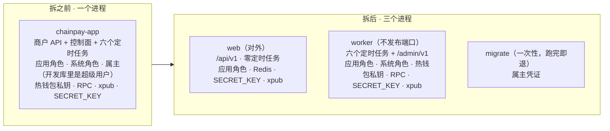

# 进程拆分 · web 与 worker

> M6 之后的一步：2026-09-15 规划，09-23 起实施，进度见第八节。
> 用户的原则：**入账、发送、追踪、对账拆进独立进程，只有它配 `chainpay_system`，web 不配。** 第二节九条取舍 09-23 全部按建议定下。

## 〇、为什么拆

拆之前只有一个进程 `chainpay-app`：商户 API、控制面、六个定时任务都在里面，所有凭证也都在它的环境变量里。
商户 API 是对外的一面，最可能出事（注入、反序列化、逻辑漏洞）；它一旦被攻破，攻击者拿到的是整个进程的钥匙串，包括能直接转空热钱包的私钥。

拆完以后，web 被攻破时拿**不到**：能看全部商户数据的系统角色、热钱包私钥、节点 key、迁移用的属主凭证。拆分**换不来**的，也要说清：

- **web 仍能冒充任何商户**：商户号是连接自己设的会话变量，RLS 挡的是「代码忘了限定商户」，挡不住一个已被控制的进程。
- **web 仍能往库里写 worker 要执行的行**（提现队列、收款地址）。所以 worker 不能信这些行，动钱之前要复核（取舍 8，坑 4、坑 5）。
- 控制面放在哪个进程，那个进程就握有管理操作的全部权力（取舍 3）。`SECRET_KEY` 两个进程都要：web 验签，worker 发凭证时加密。

**「别的项目都不拆数据库账号，我们还要不要拆」**（用户 09-23 问）：要。不拆，web 就握着系统角色，能自己写核准标记、往账本插转账给自己加余额，取舍 8 的复核核什么都核得过——对标里 Peatio 就是这个形状（第三节）。

## 一、谁需要什么，拆后放哪

| 部件 | 需要的身份 / 凭证 | 拆后 |
|---|---|---|
| 商户 API：收款地址、入账查询、白名单、提现（`/api/v1`） | 应用角色 + Redis + `SECRET_KEY` + xpub | web |
| 提现时「平台自己的地址」检查 | 拆之前：系统身份（要看全部商户的收款地址）+ 热钱包签名器（只为比对地址） | web，改用取舍 2 的函数 |
| 索引器 | 应用角色 + RPC | worker（取舍 4） |
| 入账 | 系统身份 + RPC + xpub（取舍 8b） | worker |
| 发送、追踪 | 系统身份 + RPC + 热钱包私钥 | worker |
| 对账 | 系统身份 + 两个 RPC | worker |
| 告警 | 读本进程的 `work` 健康组 | worker（取舍 5） |
| 控制面：核准、驳回、限额、注资登记、对账、索引器状态、登录、商户与凭证 | 系统身份 / 应用角色 + `SECRET_KEY` | worker（取舍 3） |
| 启动自检（身份核对 + 判官） | 系统身份 | 只在 worker |
| 迁移 | 属主 | 只在迁移那一步（取舍 1） |

两个平面按路径前缀已经分得很干净：`ApiKeyAuthFilter` 只管 `/api/`，`AdminAuthFilter` 只管 `/admin/`（且要求回环、不经代理）。

## 二、九条取舍（定下来的）

| # | 题 | 定下的 | 为什么 |
|---|---|---|---|
| 1 | 属主凭证谁持有 | 只在部署的「只迁移」那一步；web 与 worker 启动时 Flyway **只校验、不迁移**：缺迁移就拒绝启动，库比代码新（回滚后）照常 | 开发库的属主是超级用户（能关 RLS、删表、在库服务器上执行命令）；只拿走系统角色却留着属主，拆分就只剩形式。校验相当于 Airflow 的 `check-migrations`，需要给应用角色读迁移历史表 |
| 2 | web 怎么判断「这是平台自己的地址」 | 库里一个只答是 / 否的 `SECURITY DEFINER` 函数，属主 `chainpay_system`，钉死 `search_path`，`REVOKE … FROM PUBLIC` 后只授权应用角色（与建函数同一事务），函数里先自检执行身份 | 函数按属主的权限执行，调用方只拿到 true / false。不选同步地址表（等于把全部地址交给应用角色）；不挪到发送侧（同步的 400 会变成事后驳回） |
| 3 | 控制面放哪 | 整个搬进 worker；worker 的端口不发布、只在容器内回环监听，`tools/admin.sh` 进 worker 的容器执行 | 管理操作在库里都是系统角色的写入。留在 web 就得给它系统角色；写命令表挡不住（应用角色能写会话表，被攻破的 web 能伪造会话再写命令） |
| 4 | 索引器放哪 | worker | web 不再需要节点地址；状态接口与调度器在同一个进程 |
| 5 | 告警谁发 | 只有 worker；worker 连 Redis 只为健康检查 | web 保持「零定时任务」（能写成测试）；web 多开时不会重复告警 |
| 6 | 一份代码怎么装配成两个进程 | Spring profile `web` / `worker`，启动时核对恰好一个；检查只放完整应用，一次性命令不属于任何角色 | 各进程的配置放各自的 profile yml。两个 Maven 模块边界最硬，但中途大搬家不划算（见第七节） |
| 7 | compose 与发布 | 服务改名 `web` + `worker`，同一个镜像标签；顺序 迁移 → worker → 验证 → web → 验证，失败两个一起回滚 | 先升级「读」的一方：worker 读 web 写下的行，新 worker 认得新旧两种写法；worker 换坏了商户接口还没动 |
| 8 | worker 信不信 web 写进库里的行 | 不信。**8a 出金**：签名前（落库之前）复核——白名单里且 ACTIVE、不是平台地址、冻结分录对得上（同商户、同币、同额）、限额内或有人核准；「有人核准」的标记只有系统角色能写（应用角色的 INSERT 收成列级）；库守：收款地址外键指向白名单，应用角色插入时状态只能是「待核准 / 放行」。**8b 入金**：记账前用 xpub 按序号重新派生收款地址，对不上不记、叫人（worker 因此要拿 xpub）；撤掉应用角色对 `deposit_address` 的 UPDATE | 复核只有核对**应用角色写不了的事实**才有用。金融平台（Mojaloop、Kill Bill、Blnk）都在执行一侧复核，开源交易所都不做（第三节） |
| 9 | 私钥要不要再拆成独立的签名进程 | 这次不拆；复核写成边界清楚的部件，入口只有「签第 N 笔提现」，将来整体搬出去调用方不改。**KMS / 多签是上主网、碰真钱之前的前提** | worker 握着系统角色，signer 要核的每个事实它都能先改好：不同时拆出核准权，signer 是摆设 |

## 三、对标（2026-09-22 / 23）

两轮都是浅克隆原文、对到文件与行号，用完即删（出处在本节末）。

**通用项目**（Twelve-Factor、Airflow、Sentry 自托管、Mastodon、GitLab Helm chart、Apache Fineract）：
- 共识：一份代码、一个镜像、按角色起不同进程（Fineract 连命令都不换，只换开关）；迁移单独一步，Airflow、GitLab 让常驻进程先确认迁移已跑完；定时调度只留一份（Mastodon 文档明确警告调度队列只能一个进程跑）。
- 我们更严的两处：**没有一个默认按进程分数据库账号**，也没有一个用单独的属主口令迁移。依据是本地 OWASP 清单 `~/Documents/CodeProject/flow-pay-backend/docs/ai/knowledge/owasp-cheatsheets/`：`Database_Security.md` 36–40（一个账号只给一个应用或服务）、63–70（应用账号不能是库的属主）；`Secrets_Management.md` 489–495（没有哪个主体能读到全部密钥）。OWASP 讲的是「每个应用」，用到「每个进程」是我们的推论。
- 抄来的教训：Airflow 的 compose 把迁移失败吞掉（`|| true`）→ 一次性步骤的退出码必须如实；Fineract 同一个开关三种拼法、角色开关默认全开 → 禁用名单的名字要真实存在、角色要默认关闭。

**金融与交易所**（Peatio / OpenDAX / Barong、OpenCEX；BTCPay / NBXplorer、Bitcart；Web3Signer、FireFly Signer、BitGo Express；Hyperswitch 与卡数据保险库、Mojaloop、Kill Bill、Blnk；geth 交易池）：
1. **按组件分数据库账号：一个默认这么做的都没有。** OpenDAX 让交易所核心、认证服务、撮合引擎共用一个 `root`；BTCPay、Bitcart 的 Docker 部署免密登录 `postgres` 超级用户。最接近的是 Mojaloop：按服务分账号，从配置看对外的适配服务连数据库凭证都没有。这些都是开源默认部署，背后公司的生产环境看不到。
2. **认真的项目都不让对外进程碰私钥，但单独的签名服务不等于安全。** Peatio 的 API 对钱包口令只能加密、后台加密进程才能解密（OpenDAX `peatio_rails.hcl.erb:17-20` / `peatio_crypto.hcl.erb:13-16`），但部署把它还了回去：撮合引擎的策略能解开所有钥匙（`peatio_matching.hcl.erb:5-7`），明文钱包口令挂进 API 容器，所有进程共享一个带认证服务私钥的 env（`peatio.env.erb:40`）。Web3Signer、FireFly Signer 对以太坊交易谁来都签（`SendTransactionHandler.java:78-83`）；Hyperswitch 的调用方照样能从保险库取回明文卡号。替「该不该签」把关的只有 Web3Signer 的防罚没（先查再记，一个事务里加锁，`DbSlashingProtection.java:204-246`）与 BitGo 的联署。
3. **执行一侧复核：金融平台都做，开源交易所都不做。** Mojaloop 在行锁下重核流动性与限额（`facade.js:145-194`）；Kill Bill 锁账户后重读、再问网关（`IncompletePaymentTransactionTask.java:141-146`）；Blnk 锁余额、重读、重核。Peatio 签名前只核「处理中」与热钱包余额（`withdraw_coin.rb:22-61`），OpenCEX 连状态都不核。
- **异步与频率**：BTCPay 自动付款默认每小时一轮；Kill Bill 的数据库队列默认 3 秒轮询；Mojaloop 超时检查 15 秒；Hyperswitch 生产者 30 秒、消费者 3 秒。受理后异步执行是常态，我们的 10 秒偏快。
- **geth 交易池默认值**（`core/txpool/legacypool/legacypool.go:160-174`）：每个发送地址保证 16 个可执行位、最多 64 个编号有空缺的排队位。发送任务一轮最多 10 笔在 16 以内；在途积压超过 16 时池子满了先被踢——更合理的封顶是「在途笔数」（与拆分无关）。

| 仓库 | 提交 |
|---|---|
| heroku/12factor | 1385d2c80bac |
| apache/airflow | b6538c32c8b1 |
| getsentry/self-hosted | df6109d84df7 |
| mastodon/mastodon · mastodon/documentation | c99beb2e2543 · bbf263446459 |
| gitlab.com/gitlab-org/charts/gitlab | 2d1fbe943b35 |
| apache/fineract | c5160136a663 |
| postgres/postgres（REL_18_STABLE）· supabase/supabase | 9733eb9e8df7 · cd77bebafd93 |
| openware/peatio · opendax · barong | bafe53030bfe · e204b565e687 · 1f488179596f |
| Polygant/OpenCEX · OpenCEX-backend | 12d721419cc4 · 927b333d2c0e |
| btcpayserver/btcpayserver · btcpayserver-docker · dgarage/NBXplorer | a305e9517617 · 09ef31435e31 · 27585a7a83b1 |
| bitcart/bitcart · bitcart-docker | b43fef51b9db · cb6fd31eeff1 |
| Consensys/web3signer · doc.web3signer | 504118ddfeec · 6d2d2911e6e8 |
| hyperledger/firefly-signer · BitGo/BitGoJS · ethereum/go-ethereum | 7387445a3262 · 71498239fb43 · 572bd3696587 |
| juspay/hyperswitch · hyperswitch-card-vault | fb887f53fc09 · 394bf6481ba7 |
| mojaloop/central-ledger · mojaloop/helm | 9aa0385feadd · 876e6ce03e01 |
| killbill/killbill · killbill-commons · blnkfinance/blnk | cb60779c1713 · 35aaa60c202f · 91bb84d0611c |

## 四、九个小步（每步：红测 → 绿 → 拆墙 → 全套 → 真跑 → 讲）

| 步 | 做什么 | 红测 / 守卫（先写） |
|---|---|---|
| ⓪ ✅ | 九条取舍定下；对标；before 的 17 问在 `docs/retro/M6-split-before.md`（本地） | — |
| ① ✅ | 进程角色：恰好一个 profile；每个角色一张禁用名单；守卫在造 bean 之前核对（做法见第八节） | 每个禁用项各一条；没有角色、两个角色都起不来；名单名字真实存在（起真应用）；env 样例每个变量都有归属 |
| ② | 新迁移建取舍 2 的函数，同时查 `deposit_address` 与 `hot_wallet`：`SECURITY DEFINER`、钉死 `search_path`、先 `REVOKE EXECUTE … FROM PUBLIC` 再只授权 `chainpay_app`、函数体先核对执行身份能看到全部行（照 `ledger_judge()` 的「拒绝盲跑」）。`WithdrawalService` 去掉系统身份与热钱包签名器 | 只有应用角色的上下文里：提现到别家收款地址 → 400 `INTERNAL_ADDRESS`；到热钱包（已有行时）→ 400。函数守卫：SECURITY DEFINER、`search_path` 钉死、PUBLIC 无执行权。**坑 3**：非超级用户、非 BYPASSRLS 的属主调用时必须抛异常，不能返回 false |
| ③ | 取舍 8：8a 签名前复核 + 库守两条；8b 记账前重新派生 + 撤掉 UPDATE。复核写成入口只有「签第 N 笔提现」的部件 | **以应用身份直接写库**（模拟被攻破的 web）：「放行」但地址不在白名单 → 不签、停下；冻结金额不符 → 不签；超限写成「放行」→ 不签；假收款地址 + 一条转入 → 不记账；应用角色插不进后续状态、写不了核准标记、改不了收款地址 |
| ④ | 装配拆开：配置类与控制器挂 profile；`@EnableScheduling` 挪到只在 worker 生效、**不看节点配置**的类上（坑 2）；入账的装配条件改掉；拆开 `OpsHealthConfig`；`work` 分组只写在 worker 的 profile yml（Boot 默认校验分组成员存在）；worker 主端口默认绑回环；测试基类拆成 web 与 worker 两个 | web：没有系统身份、系统池、热钱包签名器、节点读取的 bean；定时任务数 0；没有 `/admin/` 映射；`db` 只有主池。worker：没有 `/api/` 映射；不配节点也调度告警；配了节点时 6 个任务、调度线程数不少于任务数 |
| ⑤ | web / worker 的 profile yml 里 Flyway 只校验（取舍 1）；worker 名单加上属主口令；「只迁移」用单独的 `env/migrate.env`；实测只给属主凭证时 `--migrate-only` 能不能起来（它的最小上下文会装配主数据源） | web / worker 不迁移；库缺迁移时拒绝启动、库比代码新时照常；只有属主凭证时 `MigrateOnlyTest` 仍绿 |
| ⑥ | 三份 env 文件各配 `.example`（第五节）；compose 拆成 `web` + `worker`，同一镜像，加固项照抄，worker 不写 `ports:`；`deploy.sh` / `rollback.sh` 按取舍 7；`tools/admin.sh` 与 `--create-admin` 指向 worker；探针与退役的变量不进任何一份 | `ContainerGuardTest` 两个服务都守；`web.env.example` 里没有 web 禁用的名字；`DeployGuardTest` 的顺序断言加上两个服务 |
| ⑦ | 真跑：两个容器都 healthy；商户流程（`tools/api.py`）与管理流程（`tools/admin.sh`）；演练：停 worker → web 照常受理并冻结，恢复后队列被消化；停 Redis → worker 告警；部署一次再回滚一次 | web 容器里按名字查，web 禁用的一个都没有；worker 里没有属主凭证 |
| ⑧ | CLAUDE.md（数据库身份表加「在哪个进程」、包结构、控制面）；运维手册「两个进程」；LEARNING-PATH；`m6-launch.md` 的「多实例」补一句（web 可以多开了，这次仍不做） | — |

## 五、每个进程拿哪些变量（只列名字）

| 变量 | web | worker | migrate |
|---|---|---|---|
| `CHAINPAY_DB_URL` | ✓ | ✓ | ✓ |
| `CHAINPAY_DB_USER` / `_PASSWORD`（应用角色） | ✓ | ✓（索引器、管理员表） | 看第 ⑤ 步实测 |
| `CHAINPAY_SYSTEM_DB_USER` / `_PASSWORD` | ✗ 有就拒绝启动 | ✓ | ✗ |
| `CHAINPAY_FLYWAY_USER` / `_PASSWORD` | ✗ 有就拒绝启动 | ✗（第 ⑤ 步起拒绝启动） | ✓ |
| `CHAINPAY_PAYOUT_HOT_WALLET_KEY` | ✗ 有就拒绝启动 | ✓ | ✗ |
| `CHAINPAY_CHAIN_RPC_URL` / `_AUDIT_RPC_URL` | ✗ 有就拒绝启动 | ✓ | ✗ |
| `CHAINPAY_CHAIN_START_BLOCK`（不是密钥） | ✗ | ✓ | ✗ |
| `CHAINPAY_DEPOSIT_XPUB` | ✓（分配地址） | ✓（取舍 8b：记账前重新派生） | ✗ |
| `CHAINPAY_SECRET_KEY` | ✓（验签） | ✓（发凭证时加密） | ✗ |
| `CHAINPAY_REDIS_HOST` / `_PORT` | ✓ | ✓（只为健康检查） | ✗ |
| `CHAINPAY_ALERT_WEBHOOK_URL` | ✗ 有就拒绝启动 | ✓ | ✗ |
| `CHAINPAY_ALERT_FORMAT`（不是密钥） | ✗ | ✓ | ✗ |
| `CHAINPAY_PORT` / `_MANAGEMENT_PORT` / `_BIND_ADDRESS` / `_LOG_LEVEL` | ✓ | ✓（主端口绑容器内回环） | ✗ |
| `CHAINPAY_ADMIN_PASSWORD`（只在 `--create-admin` 那一条命令的环境里） | ✗ 有就拒绝启动 | ✗ 有就拒绝启动 | ✗ |
| `CHAINPAY_SEPOLIA_RPC` / `_AUDIT_RPC`（只给测试探针，放 `env/probe.env`） | ✗ | ✗ | ✗ |
| `CHAINPAY_ADMIN_TOKEN`（已退役，没有代码读它） | ✗ | ✗ | ✗ |

## 六、坑

### 坑 1：属主凭证就在应用容器里，而且属主是超级用户（实测）

拆之前 `chainpay-app` 的环境变量里有 `CHAINPAY_FLYWAY_USER` / `_PASSWORD`（只看了名字）。开发库里 `chainpay` 是 `rolsuper = t`、`rolbypassrls = t`（它就是 compose 的 `POSTGRES_USER`）；`chainpay_app` 两项都是 f；`chainpay_system` 只有 BYPASSRLS。compose 的 `app` 只有一个 env_file，所以「拆 env 文件」和「取舍 1」是同一件事。

### 坑 2：`@EnableScheduling` 挂在「配了节点」上（读代码 + 推断）

全仓库只有 `ChainIndexerConfig` 一处 `@EnableScheduling`，而这个类只在配了节点地址时装配。没有它的进程里，`@Scheduled` 方法根本不会被调度：bean 还在、方法永远不被调用、没有任何报错（按 Spring 的装配规则推断，未实测）。现有的告警测试是手动调用 `tick()`，证明的是「装配了」不是「在跑」。第 ④ 步的第一条红测要先把它实测出来。

### 坑 3：`SECURITY DEFINER` + FORCE RLS + 非超级用户属主，对所有地址都回答「不是」

`deposit_address` 开了 FORCE RLS：连属主也受策略约束，只有超级用户和 BYPASSRLS 例外。开发库与测试库的属主都是超级用户，所以函数在这两处都表现正确；换到属主不是超级用户的库，它一行都看不到、对所有地址都返回 false——提现检查被静默放行，而所有测试照样是绿的。第 ② 步的函数自检与那条专门的测试就是冲着它去的。

### 坑 4：提现队列——应用角色能插任意状态的提现，发送任务签名前不复核

- `payout` 上应用角色有 INSERT（`V21__payout.sql:215`），策略只核商户号（`V22__scan_patch.sql:139-142`），而商户号是连接自己设的会话变量（`V6__row_level_security.sql:71-75`）。
- 状态的 CHECK 允许全部八种，收款地址只查形状、没有外键指向白名单，全库没有触发器。白名单、限额、平台地址三道门只写在 web 的 `WithdrawalService` 里；`PayoutSender` 取「放行」的行就签名。
- 连起来：被攻破的 web 冒充商户 → 冻结它的可用余额（冻结本身合法）→ 插一行「放行」、收款地址是攻击者的 → worker 照签照发，上限是各商户的可用余额。今天一个 SQL 注入就能走这条路；拆分之后它是「web 失守 → 钱出门」剩下的主要通道。→ 取舍 8a、第 ③ 步。

### 坑 5：收款地址——应用角色能插、能改收款地址，入账不重新派生

- `GRANT SELECT, INSERT, UPDATE ON deposit_address TO chainpay_app`，全仓没有代码用到 UPDATE；入账靠那一行决定「记给谁」，不按 xpub 重新派生核对。
- 连起来：被攻破的 web 插一行收款地址 = 攻击者的新地址 → 攻击者自己转一笔进去 → 入账照记成商户余额（余额核对也过）→ 按正常流程提走热钱包的真钱 → 再把那个地址里的币转走。对账每小时一次会报托管总额对不上，但钱已经出去了；8a 拦不住（账本看来是合法入账之后的合法提现）。→ 取舍 8b、第 ③ 步。

### 另外要实测的

- 只给属主凭证时，`--migrate-only` 能不能起来（第 ⑤ 步）。
- 两个 profile 意味着测试里缓存两个上下文，每个上下文主池 10 条、系统池 2 条连接，留意测试库的 `max_connections`。
- `db/init/01-roles.sql` 里的口令只供开发使用，不要抄进新的 `.example` 文件。

## 七、不做的

- **拆成两个 Maven 模块**（编译期边界）。回来换的条件：出现第三个进程，或者有第二个人同时改代码。
- **每个进程一个镜像**：继续用同一个镜像，靠 profile 区分。
- **网络与数据库层再加一道**（`pg_hba.conf` 只允许 worker 的地址以 `chainpay_system` 登录、web 与 worker 分到不同的 docker 网络）：需要固定容器地址，搬到真机器上再做。
- **web 多开几份**：拆完就具备条件（web 没有定时任务，限流与防重放在 Redis 里），这次不做。
- **worker 挂了由谁叫人**：需要外部心跳监控，M7 以后。
- **单独的签名进程**（取舍 9）与 **KMS / 多签**：上主网之前的前提。
- **生产上让属主不是超级用户**：DBA 的事；坑 3 的防护这次就做。
- **和本题无关、仍没关掉的**：TOTP、提现冷却期、管理员增删；收款地址分配的风险——状态为 DISABLED 的地址照样被返回、账户编码用 symbol（同名代币会合进一个账）、地址分配之前打进来的钱会记给后来分到这个地址的人、账户编码里的冒号有歧义、「代币 ACTIVE」的检查范围比索引器实际索引的范围宽（「xpub 被换掉没人发现」由 8b 关掉）。

## 八、进度

- ✅ ⓪ 取舍与对标（09-23）
- ✅ ① 进程角色（09-23，`e3a5f81`）
- ⬜ ② web 的平台地址检查改走是 / 否函数
- ✅ 系统侧改用 `@Transactional("system")`（方案甲，09-23 定，同日换完；和拆分正交）：第一批对账、注资登记、健康检查（`4cc09bf`）；第二批入账、核准、追踪、发送，删掉 `inTransaction` / `Session`。
  `WithdrawalService` 那一问先搬进 `PlatformAddresses`（自己一个系统事务，问完就还连接），② 把它换成是 / 否函数
- ⬜ ③ worker 不信 web 写的行（取舍 8）
- ⬜ ④ 装配拆开
- ⬜ ⑤ 属主口令只在迁移那一步 + 启动时校验库版本
- ⬜ ⑥ env、compose、部署脚本
- ⬜ ⑦ 真跑与演练
- ⬜ ⑧ 文档

**① 的做法**：`ops/role/ProcessRole`（两个角色各一张禁用名单，每项写环境变量名、配置键、它能干什么；web 七项，worker 一项）；`ops/role/ProcessRoleConfig`（静态、最高优先级的 BeanFactoryPostProcessor，在造 bean 之前核对，一次性命令的最小上下文不扫描它）；compose 的 `app` 以 `worker` 身份跑，测试基类激活 `test` + `worker`；「密钥形态的变量名」收口到 `tools/image-check.sh`（补 `WEBHOOK_URL`、`RPC`），测试经 `SecretNames` 读；探针的节点地址挪到 `env/probe.env.example`。
拆墙：守卫写成普通 bean → 应用在它之前就去建连接（`Connection refused`）；名单上的配置键拼错 → 只有起真应用的测试红。真跑：同一份环境以 web 身份起 → 拒绝启动、点名六个变量、没建任何连接池；不给角色 → 拒绝启动；输出里没有任何密钥值。
